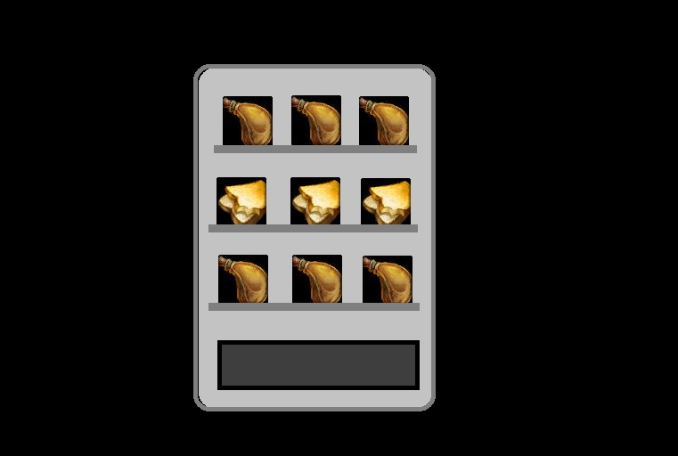
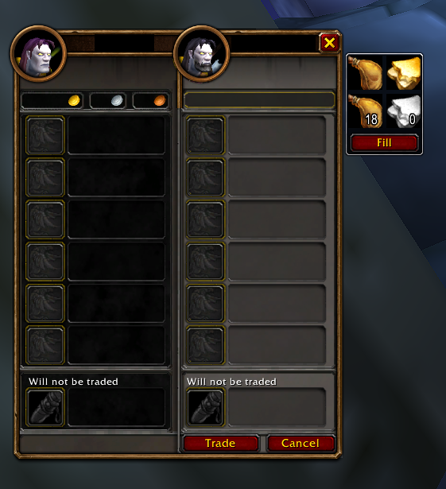

# VendingMachine

A World of Warcraft addon for mages on WoW Forever who hand out food and water.
When you open a trade window, a small panel appears next to it:

- **Top row:** conjure water and conjure food, using the highest rank you know.
- **Bottom row:** your best conjured water and food, with how many you have.
  Click one to put a stack in the trade window.
- **Fill:** fills the rest of the trade window, half water and half food.

It always hands over your best conjured items first, fullest stacks first.
There are no commands or settings: the panel just appears when you trade.

## Install

1. Download the VendingMachine zip from the
   [latest release](https://github.com/frogwizard-dev/vending-machine/releases/latest).
2. Unzip it into `World of Warcraft\_classic_beta_\Interface\AddOns\`, so that
   you have an `AddOns\VendingMachine` folder containing `VendingMachine.toc`.
   Windows' Extract All adds an extra folder named after the zip, so if you end
   up with `AddOns\VendingMachine-1.0.1\VendingMachine`, move the inner
   `VendingMachine` folder up into `AddOns`.
3. Start the game (restart it if it was already running) and check that the
   addon is enabled on the character select screen (AddOns button).
